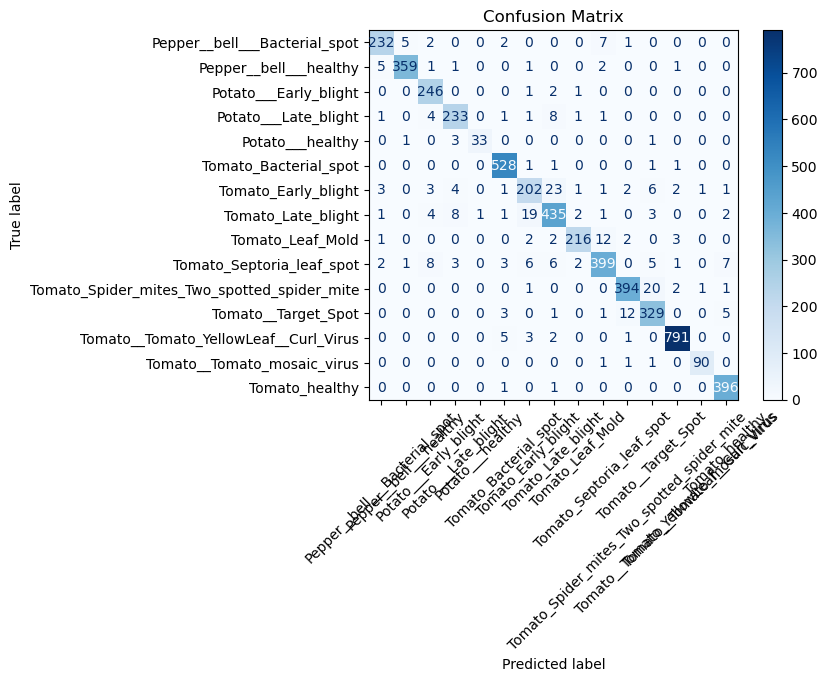
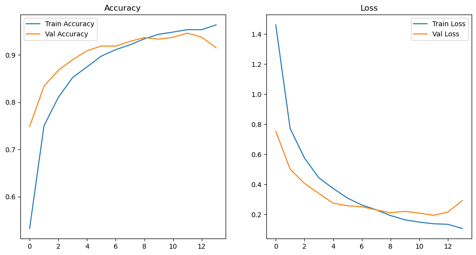
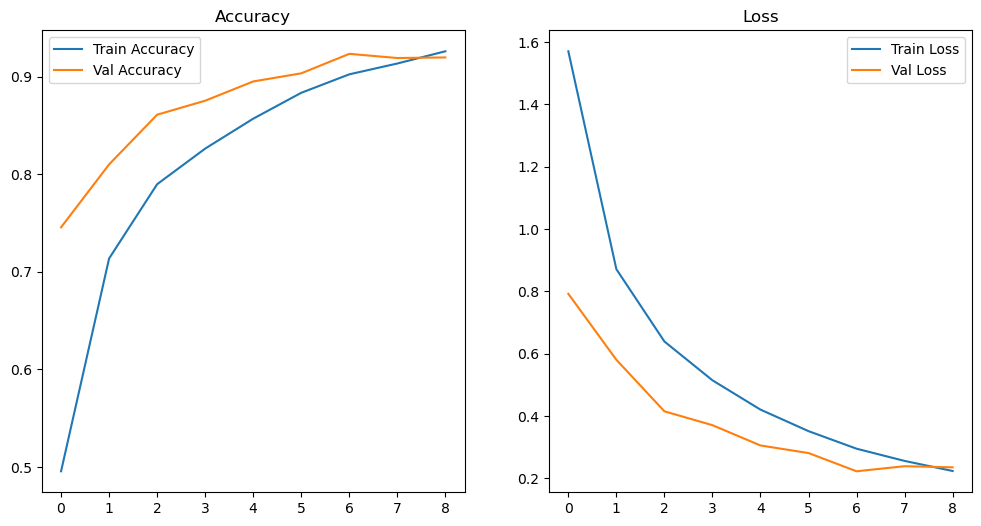

# Plant Disease Classification API
This project focuses on detecting and classifying various plant diseases using a convolutional neural network (CNN) model trained on a labeled dataset of plant leaf images. The model is integrated with a FastAPI backend and exposes RESTful endpoints for prediction and retraining. It is also deployed as part of a mobile application to enable real-time disease detection.

## Key Features
1. Trained CNN Model:

- Achieves high accuracy on the provided dataset.
- Outputs predictions as probabilities and class labels.

2. API Integration:

- Exposes endpoints for prediction, retraining, and real-time camera-based prediction.
- Easily integrates with a mobile application for on-the-go predictions.

3. Retraining Capability:

- Accepts new data to improve model accuracy.
- Automatically updates the dataset and re-trains the model.

## Dataset
The dataset includes labeled images of healthy and diseased plant leaves. It is organized into folders for each class. The dataset can be accessed here:

### Dataset Link
- Kaggle

## Model Metrics and Outcomes
- Confusion Matrix
The model's performance is summarized in the confusion matrix below, showcasing its classification accuracy across different plant classes.

- Training History
The initial training history demonstrates the accuracy and loss evolution over epochs.

Training Accuracy: ~98%
Validation Accuracy: ~96%
Training Loss: Converges to ~0.2
Validation Loss: Converges to ~0.3
Retraining History

- The retraining history after including new data is as follows:

Retrained Training Accuracy: ~99%
Retrained Validation Accuracy: ~97%
Improved Loss Values: Training loss ~0.1, validation loss ~0.2

## API Endpoints

1. /predict/upload - Predict Disease from Uploaded Image
Method: POST
Input: An image file (File format).
Output:
Predicted class (e.g., "Potato_Late_blight").
Confidence percentage

2. /retrain - Retrain the Model with New Data
Method: POST
Input: An image file (File format).
Output:
Predicted class for the new image.
Confidence score.

3. /predict/camera - Predict Disease from Camera Capture
Method: GET
Output:
Predicted class.
Confidence percentage.
This endpoint captures an image using a connected camera and predicts its class.

4. /train - Retrain the Model with Entire Dataset
Method: POST
Output: A message indicating the retraining status.

## Integration with Mobile Application
The API is seamlessly integrated into a mobile application, allowing users to:

- Upload images of leaves for disease detection.
- Capture live photos for instant predictions.
- Benefit from updated model predictions with retrained data.
- How to Interact with the API

## Testing:

Use tools like curl, Postman, or integrate with mobile apps.
Requirements:

API is built with FastAPI and hosted on a cloud platform.
Deployment Details
The project is deployed using:

## Backend: FastAPI.
Model Framework: TensorFlow/Keras.
Server: Render or any scalable cloud provider.
To run locally, install dependencies and start the FastAPI server

### End point:
https://plant-disease-classifier-tsau.onrender.com/docs

## File Structure Overview
1. notebook
- Contains Jupyter notebooks for experimentation and initial analysis, such as Plant_disease_classifier.ipynb.
2. plantvillage
- The Flutter app
3. plots
- Stores visualization files such as training history, retraining history, and confusion matrix
4. src
- The core implementation pipelines for the project:
- dataset: Contains your dataset folder, likely structured into subfolders for different classes.
- models: Stores trained model files (e.g., cnn_model.h5) and encoders (label_encoder.pkl).
- main.py: Entry point for the FastAPI application. Contains the API endpoints for model inference and retraining.
- load_data.py: Handles dataset loading and preprocessing logic.
- train_model.py: Includes the training pipeline for the CNN model.
- preprocess.py: Likely contains helper functions for image preprocessing.
- predict_from_camera.py & predict_from_file.py: Scripts for prediction using camera or file inputs.
- main_pipeline.py: Coordinates data flow, training, and other pipelines.
- requirements.txt: Lists dependencies required to run the project (e.g., FastAPI, TensorFlow).

